# Nooka

<p align="center">
  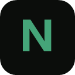
</p>

<h3 align="center">Новая вкладка Chrome как доска закладок</h3>

<p align="center">
  Страницы → доски → ссылки. Перетащил, бросил, готово. Без аккаунта,<br/>
  без сборки, все данные остаются в этом браузере.
</p>

<p align="center">
  
  
  
  
</p>

<p align="center">
  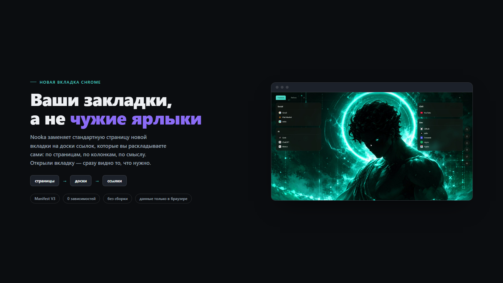
</p>
<p align="center">
  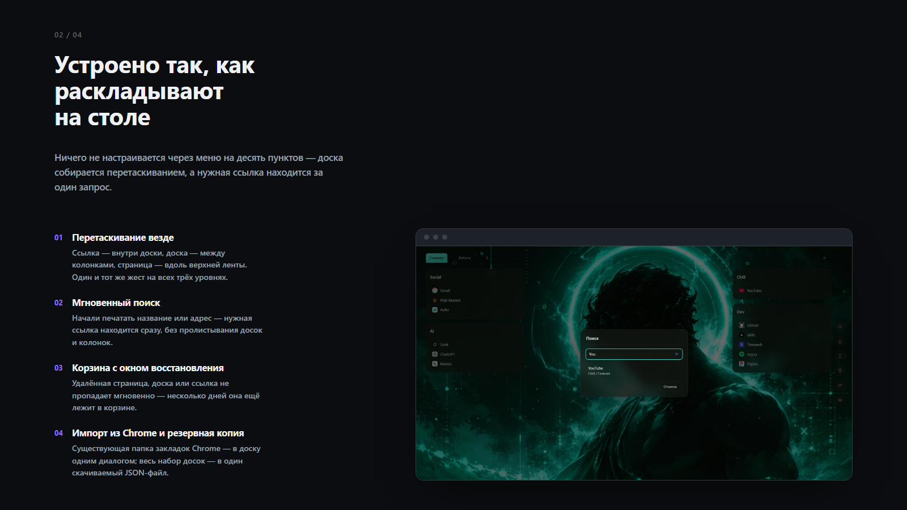
</p>
<p align="center">
  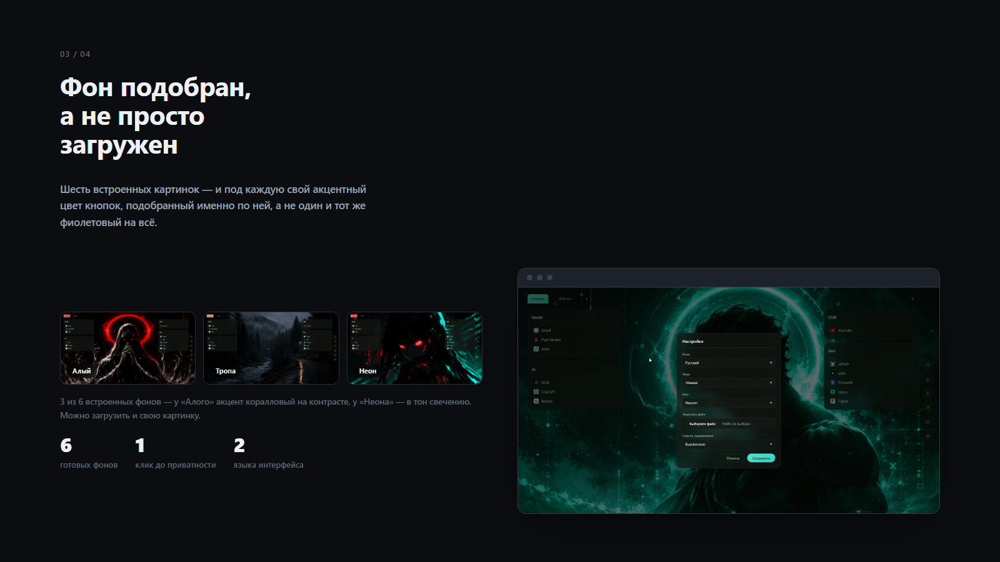
</p>
<p align="center">
  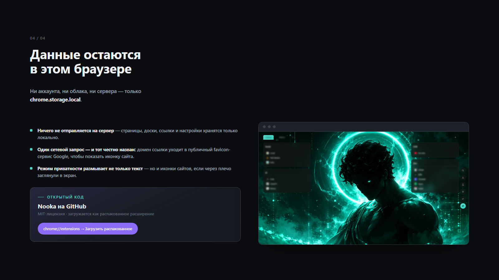
</p>

## Что это

Nooka заменяет стандартную страницу новой вкладки Chrome на ваши собственные
доски закладок, устроенные так, как удобно вам:

Открыли новую вкладку — увидели свои ссылки, а не строку поиска и шесть
чужих ярлыков.

## Возможности

<table>
<tr>
<td width="50%" valign="top">

**Страницы, доски, ссылки**
Сколько угодно вкладок-страниц, у каждой свои колонки досок, в каждой доске —
список ссылок.

**Перетаскивание везде**
Ссылки внутри доски, доски между колонками, страницы вдоль верхней ленты —
всё берётся мышью и переносится куда нужно.

**Мгновенный поиск**
Найти сохранённую ссылку по названию или адресу, не отвлекаясь на пролистывание
досок.

**Режим приватности**
Один клик размывает заголовки и иконки сайтов — если через плечо заглянули,
закладки не видны.

</td>
<td width="50%" valign="top">

**Тёмный интерфейс в стекле**
Шесть встроенных фонов, у каждого свой акцентный цвет кнопок, подобранный
именно под него, — или своя картинка.

**Импорт закладок Chrome**
Забрать существующую папку закладок Chrome в доску одним диалогом, когда
понадобилось.

**Резервная копия**
Весь набор досок — один скачиваемый JSON-файл, без облачного аккаунта.

**Корзина с окном восстановления**
Удалённые страницы, доски и ссылки несколько дней лежат в корзине, прежде
чем исчезнуть окончательно.

</td>
</tr>
</table>

<p align="center">
  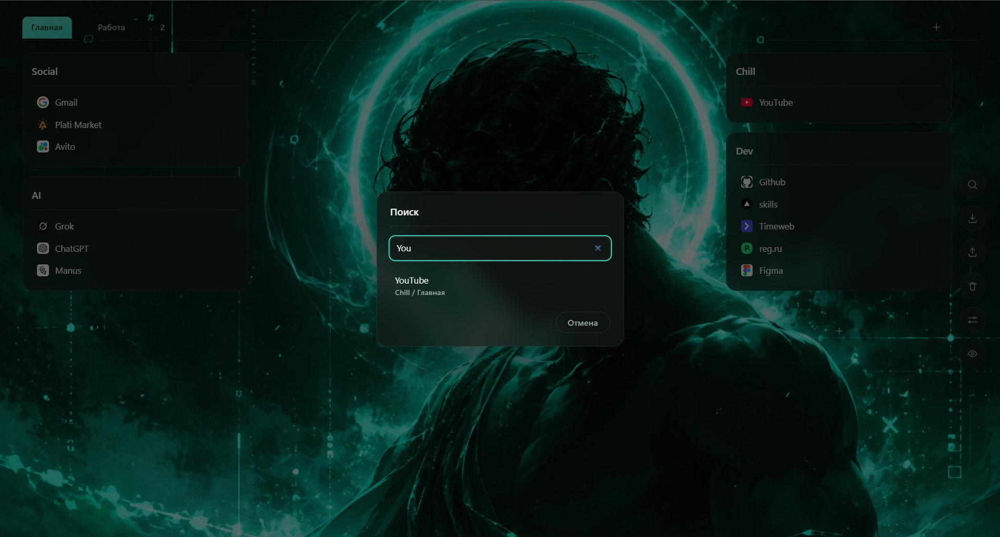
</p>

## Фоны с подобранным акцентом

Шесть встроенных картинок — и под каждую свой акцентный цвет кнопок, чтобы
сочетаться с фоном, а не спорить с ним.

<p align="center">
  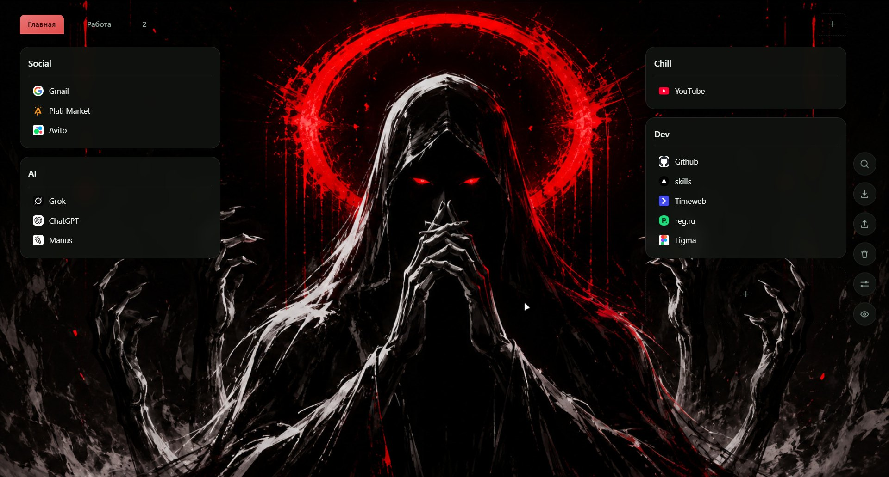
  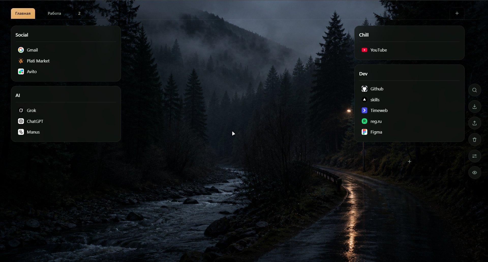
  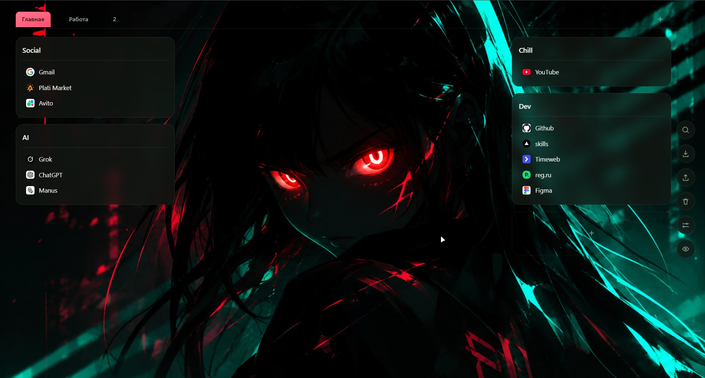
</p>
<p align="center">
  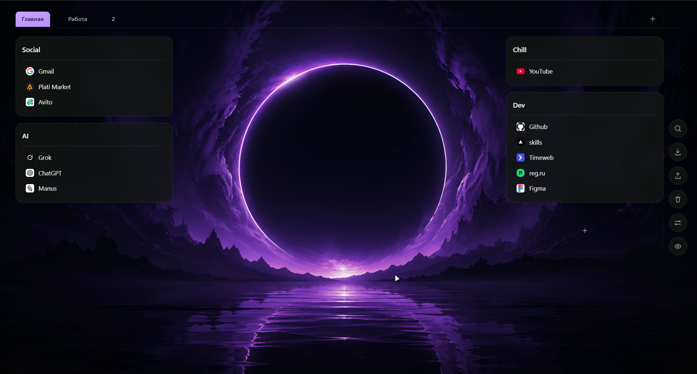
  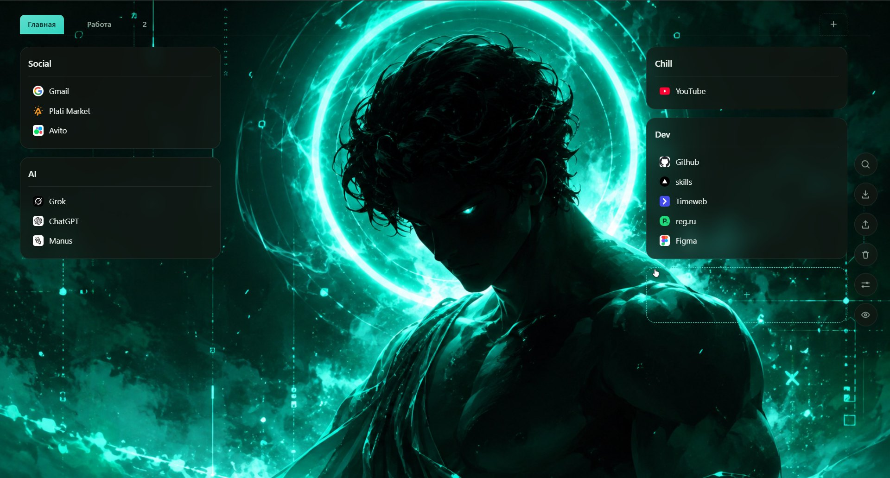
  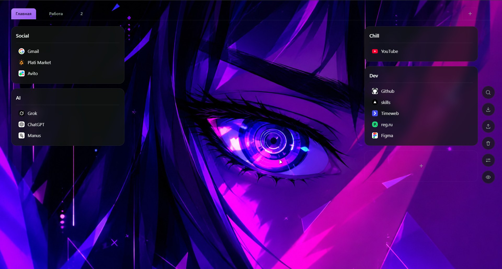
</p>
<p align="center">
  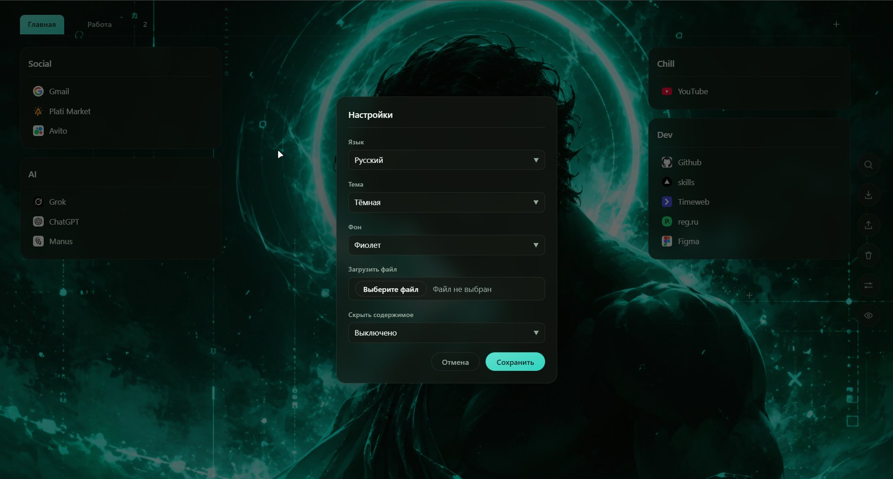
</p>

## Приватность

Ваши страницы, доски, ссылки и настройки хранятся только в этом браузере,
через `chrome.storage.local` — ничего не отправляется на сервер. Единственное
исключение: чтобы показать настоящую иконку сайта даже для ссылки, которую вы
ни разу не открывали в этом браузере, Nooka запрашивает у публичного
favicon-сервиса Google (`google.com/s2/favicons`) только домен сохранённой
ссылки — никогда не полный адрес, не заголовок, ничего больше. Это
единственный сетевой запрос расширения.

<p align="center">
  
</p>

## Установка

Nooka пока не в Chrome Web Store — загрузите как распакованное расширение:

1. Скачайте или склонируйте этот репозиторий.
2. Откройте `chrome://extensions` в Chrome.
3. Включите **Режим разработчика** (переключатель справа вверху).
4. Нажмите **Загрузить распакованное расширение** и выберите папку
   [`extension/`](extension).
5. Откройте новую вкладку.

Chrome не подхватывает изменения файлов сам — после правки исходников
перезагрузите расширение с его карточки на `chrome://extensions`.

<p align="center">
  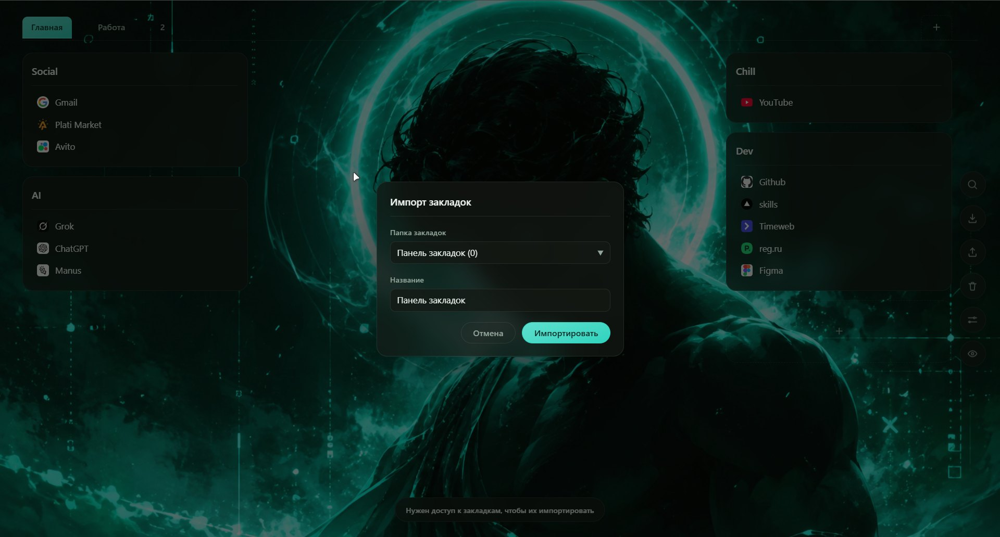
</p>

## Разработка

Сборки нет — расширение работает прямо из исходников как ES-модули.

```bash
npm test        # юнит-тесты core/ (node --test)
```

- `extension/src/core/` — модель данных и переводы, без `chrome.*` и `document`.
- `extension/src/app/` — рендер новой вкладки, хранилище, drag & drop и все
  команды панели (поиск, резервная копия, корзина, импорт, настройки…).
- `extension/src/popup/` — попап быстрого сохранения на панели инструментов.

## Лицензия

[MIT](LICENSE)
